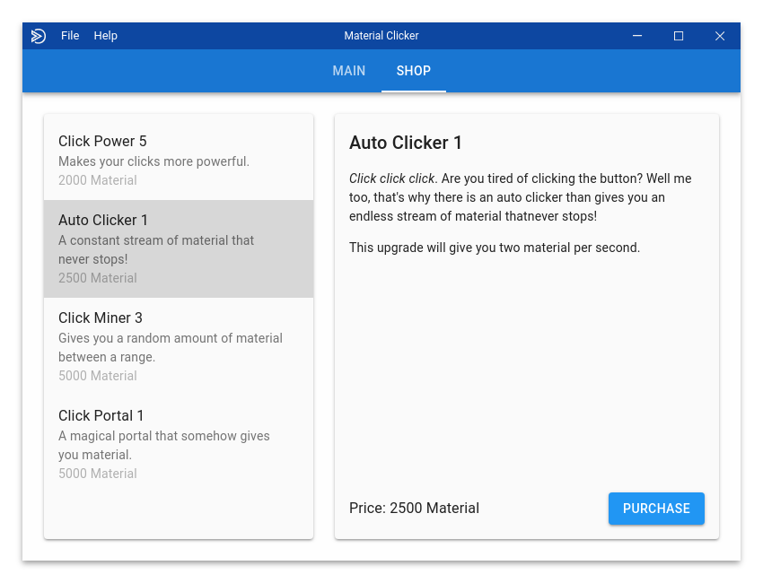

# Material Clicker
> A clicker game using Electron and Material UI.

## Downloads
- **[Windows (64 bit)](https://github.com/WeAreDevs/material-clicker/releases/download/latest/material-clicker-windows-x64.exe)**
- **[Windows (32 bit)](https://github.com/WeAreDevs/material-clicker/releases/download/latest/material-clicker-windows-x86.exe)**
- **[MacOS](https://github.com/WeAreDevs/material-clicker/releases/download/latest/material-clicker-mac.zip)**
- **[Linux (64 bit) (deb)](https://github.com/WeAreDevs/material-clicker/releases/download/latest/material-clicker-linux-x64.deb)**
- **[Linux (64 bit) (rpm)](https://github.com/WeAreDevs/material-clicker/releases/download/latest/material-clicker-linux-x64.rpm)**
- **[Linux (32 bit) (deb)](https://github.com/WeAreDevs/material-clicker/releases/download/latest/material-clicker-linux-i386.deb)**
- **[Linux (32 bit) (rpm)](https://github.com/WeAreDevs/material-clicker/releases/download/latest/material-clicker-linux-i386.rpm)**

[View Changelog](CHANGELOG.md)

## Goal
The original goal of this project was to use as many components from
[Material Design Components](https://material.io/develop/web/) as we could, starting with
this new version of the game, we will no longer be using those components and TypeScript,
and instead we will be using regular JavaScript, [React](https://reactjs.org/), and
[Material UI](https://material-ui.com). And instead of going for using all components, we want
to just create the best game possible using what he have available.
